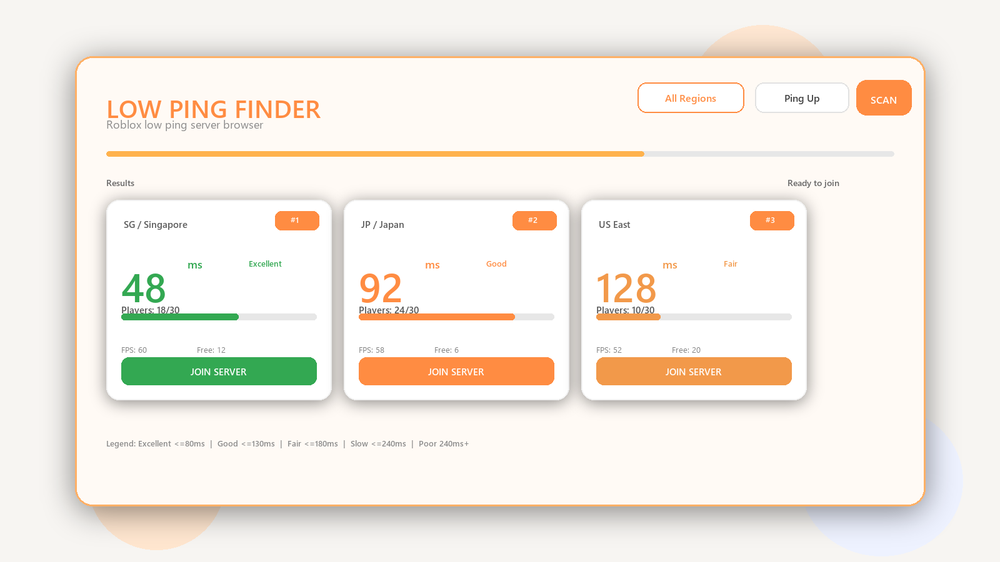

# Roblox Low Ping & Capacity Finder v10.0

Userscript สำหรับค้นหา Roblox public servers ที่ ping ต่ำและมีช่องว่างตามต้องการ พร้อม UI โทนส้ม/ขาว

---

## Features

- สแกน public servers จากหน้าเกม Roblox โดยตรง
- Filter ได้ 2 โหมด
  - `All Servers`
  - `Min Free Slots` (กำหนดจำนวนช่องว่างขั้นต่ำเอง)
- Sort ได้ 2 แบบ
  - `Ping ↑`
  - `Players ↓`
- แสดงข้อมูลหลักใน card
  - Server ID (ย่อ)
  - Ping
  - Players และ Free Slots
- ปุ่ม `JOIN SERVER` เข้า server ได้ทันที
- มี progress bar และสถานะระหว่างสแกน

---

## Installation

1. ติดตั้ง userscript manager เช่น Tampermonkey หรือ Violentmonkey
2. สร้างสคริปต์ใหม่
3. วางโค้ดจาก [script.js](script.js)
4. เปิดหน้า Roblox เกมที่ URL รูปแบบ `https://www.roblox.com/games/...`
5. ใช้งานแผง `SERVER FINDER PRO`

---

## Usage

1. เลือกโหมด `Filter`
2. ถ้าใช้ `Min Free Slots` ให้ใส่จำนวนในช่องตัวเลข
3. เลือก `Sort`
4. กด `SCAN`
5. กด `JOIN SERVER` บนการ์ดที่ต้องการ

---

## Notes

- ค่า ping มาจากข้อมูล API ของ Roblox ในช่วงเวลานั้น
- ถ้า API ช้าหรือถูกจำกัด อาจกระทบผลลัพธ์การสแกน

---

## Files

- [script.js](script.js)
- [README.md](README.md)
- [preview.png](preview.png)
